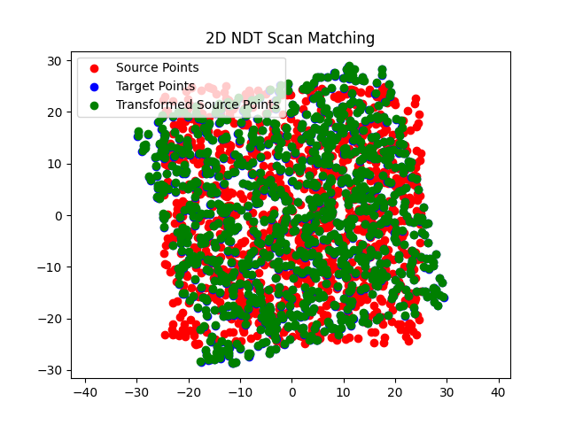

# Python sample code of 2D NDT Scan Matching
This Python script demonstrates a 2D scan matching algorithm called Normal Distributions Transform (NDT) for aligning two point clouds. NDT is commonly used in robotics for tasks like localization and mapping. The script generates synthetic point clouds, transforms one of them, and tries to recover the true transformation parameters by matching the transformed point cloud to the original.

## Usage
To run the script, simply execute the following command in your terminal:

```bash
python script/normal_distributions_transform.py
```
.
## Results
After running the script, a plot will be displayed showing the source points (red), target points (blue), and transformed source points (green). The true and estimated transformation parameters will also be printed.

```
True transform: [0.1        0.2        0.26179939]
Estimated transform: [0.11679415 0.28055845 0.25984399]
```




